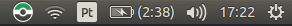

# Pokemon GO servers status

Check the status of the Pokemon GO servers from your Appindicator (Linux)

color code:

- green: server up
- orange: server unstable
- red: server down

## Credit

The original app for MacOS made by [Lacsap-](https://github.com/Lacsap-/pokemon-go-status)

The pokeball status icons were made by: [omgomg](https://github.com/omgmog)
